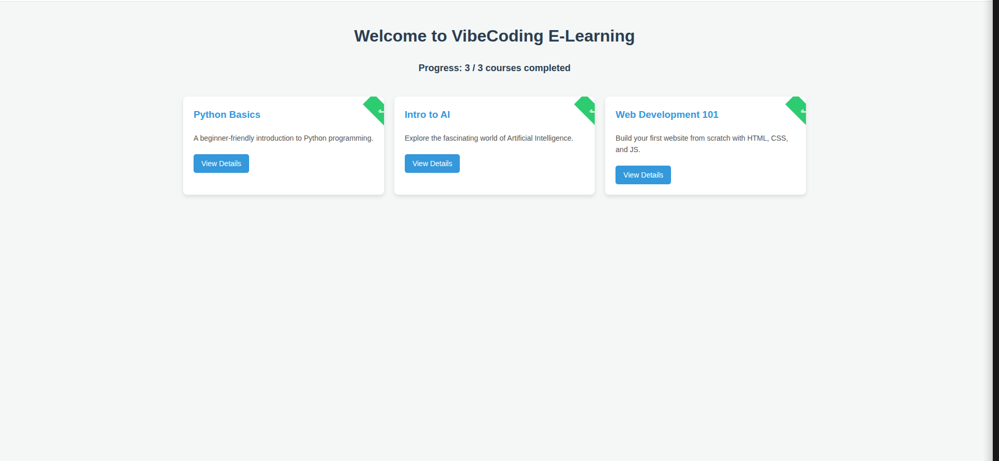
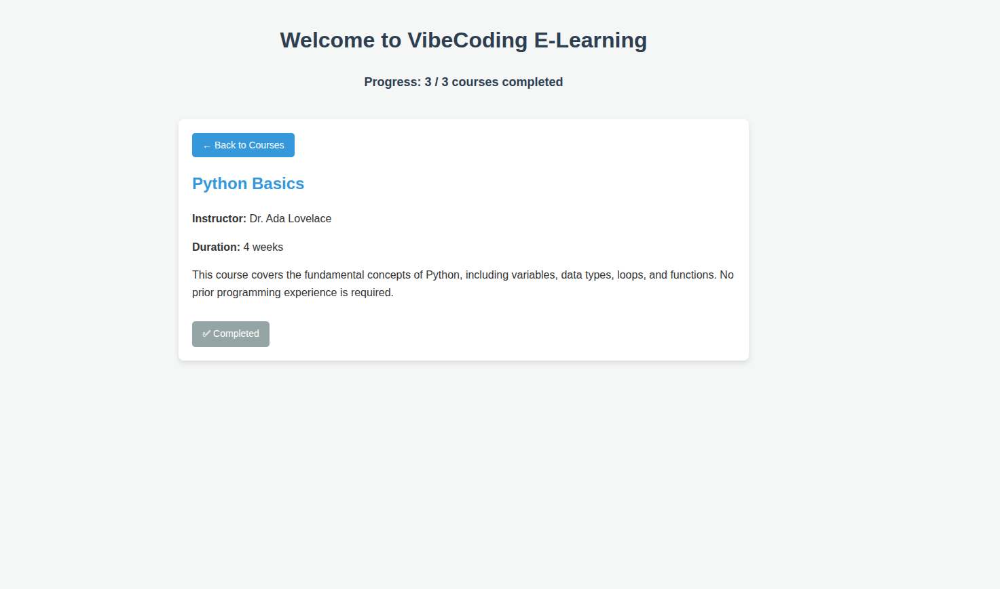

# Mini E-Learning Platform

## Project Overview
This project is a simple, frontend-only prototype of an e-learning platform. It was created as an application of concepts from the Week 1 VibeCoding session. The platform lists available courses, allows users to view details for each course, and lets them mark courses as completed. All progress is saved in the browser's LocalStorage, so it persists between sessions.

## Features
- **Course Listing:** Displays a list of available courses with titles and short descriptions.
- **Course Details:** Provides a detailed view for each course, including instructor, duration, and a full description.
- **Completion Tracking:** Users can mark a course as completed.
- **Persistent Progress:** Completion status is saved to LocalStorage, so it's not lost when the page is refreshed.
- **Progress Counter:** Shows the number of completed courses out of the total available.
- **Responsive Design:** The layout adapts to different screen sizes.

## Technologies Used
- **HTML:** For the structure and content of the web pages.
- **CSS:** For styling the application, using Flexbox/Grid for a responsive layout.
- **JavaScript:** For all interactivity, including DOM manipulation, event handling, and interacting with LocalStorage.

## How to Run the App
No special setup is required. This is a purely frontend application.

1.  Clone or download the project files.
2.  Navigate to the `e-learning-platform` directory.
3.  Open the `index.html` file in your preferred web browser (e.g., Chrome, Firefox, Safari).

That's it! The application will run entirely in your browser.

## UI Preview

### Course Listing Page

### Course Details Page
